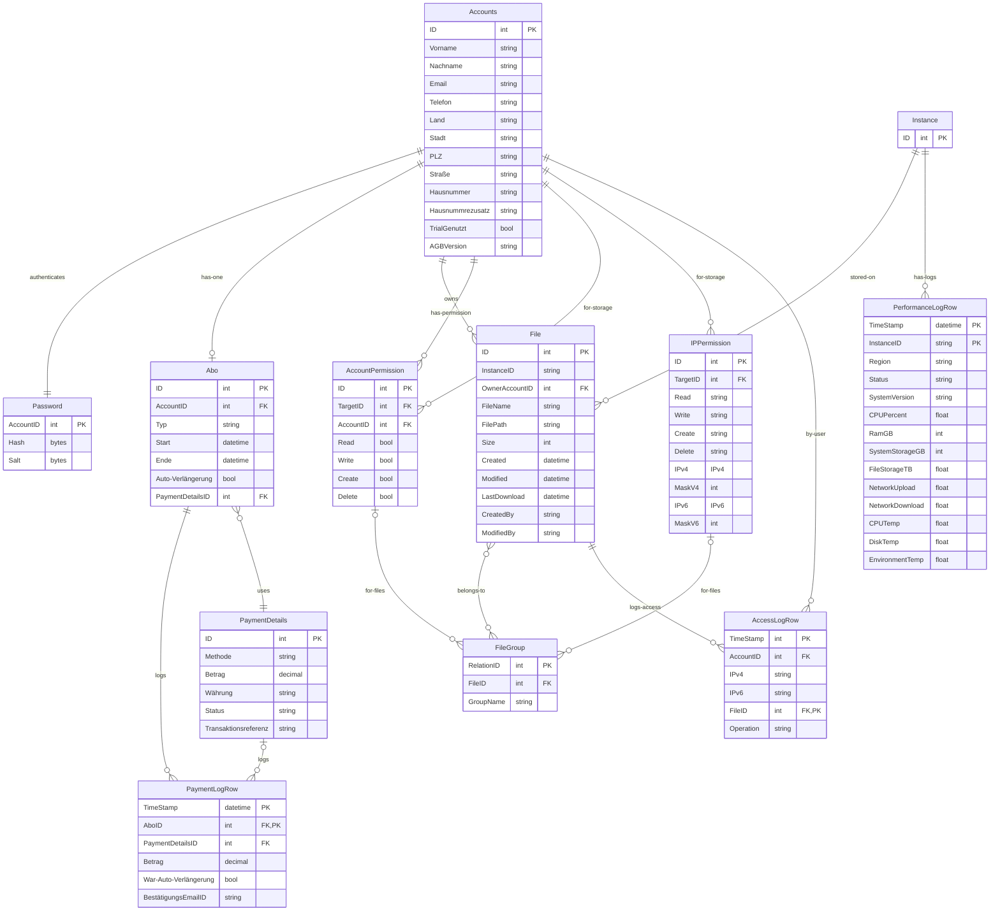

# Schemas

## ER Diagram

## Accounts DB

Unter der Accounts Datenbank werden die Informationen zu dem Nutzer, dessen verschlüsseltes Passwort, dessen Abo und entsprechende Zahlungsmethoden gespeichert. 

### PII zu Nutzer ID

Hier werden alle persöhnlichen Informationen des Kontoinhabers. Mit einem Primärschlüssel als ID, es wird auch festgelegt welches Abbo der Benutzer hat und welche AGBVersion hinterlegt ist. TrialGenutzt ist ob der Nutzer ein Probeabo verwendet hat oder nicht.

Accounts(ID, Vorname, Nachname, Email, Telefon, Land, Stadt, PLZ, Straße, Hausnummer, Hausnummrezusatz, TrialGenutzt, AGBVersion)

### Password / Auth

Eine Tabelle in denen die Benutzer IDs mit ihren Passwörtern gespeichert werden. Account ID ist als Fremdschlüssel und die Passwörter sind als Hash gespeichert um diese Anonym zu halten.

Password(AccountID, Hash, Salt)

### Abos zu Nutzer ID

Hier werden Informationen zu den Abo des Kontoinhabers gespeichert. Mit einer eigenen ID als Primarschlüssel und der Account ID und PaymentDetailsID als Fremdschlüssel. Die PaymentDetailsID wird nur in dem Fall einer Autoverlängerung eingesetzt.

Abo(ID, AccountID, Typ, Start, Ende, Auto-Verlängerung, PaymentDetailsID)

### Payment Details

Hier sind die Informationen zu den Zahlungsmethoden gespeichert. Es werden Zahlungsmethode den Betrag und die Währung gespeichert und die Transaktionsreferenz ist eine externe angabe von der Bank. 

PaymentDetails(ID, Methode, Betrag, Währung, Status, Transaktionsreferenz)

### Payment Logs

Hier werden die Zahlungen gespeichert. Wann sie stattfanden und wie hoch sie waren, und ob es teil einer Automatischen verlängerung war oder nicht. Eine bestätigungsmail wird als Fremdschlüssel eingesetzt um Nachzuvollziehen um die Zahlung zu bestätigen. Als Fremdschlüssel ist auch die AboID übergeben um nachvollziehen zu können welche Nutzer welche Zahlung gemacht hat.

PaymentLogRow(TimeStamp, AboID, PaymentDetailsID, Betrag, War-Auto-Verlängerung, BestätigungsEmailID)

## Service DB

In der Service Datenbank werden die Dateien zum Nutzer und die entsprechenden Berechtigungen gespeichert. 

### Instance 

Die Instanze ist eine ID für den Server welcher gerade dem Nutzer seine Daten zur verfügung stellt.

Instance(ID)

### Datei zu Nutzer ID

Hier werden informationen zu den Dateien des Benutzers hinterlegt. Mit einer eigenen ID als Primärschlüssel. Die InstanceID und die OwnerAccountID dienen als Fremdschlüssel um den Server und den Nutzer zuweisen zu können. Zusätzliche werden daten wie Dateiname, Dateipfad, die größe der Datei, wann sie erstellt wurde und von wem die Datei geändert wurde.

File(ID, InstanceID, OwnerAccountID, FileName, FilePath, Size, Created, Modified, LastDownload, CreatedBy, ModifiedBy)

### Datei Berechtigungen

In Datei Berechtigungen werden drei Tabellen hinterlegt, die Berechtigungen welche einer adresse und dessen Netzwerk zugeteilt sind in der IPPermission, den berechtigungen welche einem Account zugeteilt sind in der AccountPermission und die Menge der Dateien für die, die Berechtigungen gelten. In IPPermission gibt es einen eigenen Primärschlüssel mit einer option für zulassen oder verweigern für das Schreiben, lesen, erstellen oder löschen von Dateien. In den AccountPermissions gibt es eine eigene ID als Primärschlüssel mit den gleichen möglichkeiten wie in den IPPermissions für das bearbeiten der Dateien. In den Tabellen IPPermissions und Accountpermissions gibt es FileGroup als Fremdschlüssel. In FileGroup ist hinterlegt für welche menge der Dateien die Berechtigungen gelten. 

IPPermission(ID, TargetID, Read(Grant/Deny), Write(Grant/Deny), Create(Grant/Deny), Delete(Grant/Deny), IPV4, MaskV4, IpV6, MaskV6, FileGroup)

AccountPermission(ID, AccountID, TargetID, Read(True,False), Write(True,False), Create(True,False), Delete(True,False), FileGroup)

FileGroup(RelationID, GroupName, FileID)

## Logs DB

### File Access Logs

AccessLogRow(TimeStamp, AccountID, IPv4, IPv6, FileID, Operation)

### Performance Logs

PerformanceLogRow(TimeStamp, InstanceID, Region, Status, SystemVersion, CPU%, RamGB, SystemStorageGB, FileStorageTB, NetworkUpload, NetworkDownload, CPUTemp, DiskTemp, EnvironmentTemp)